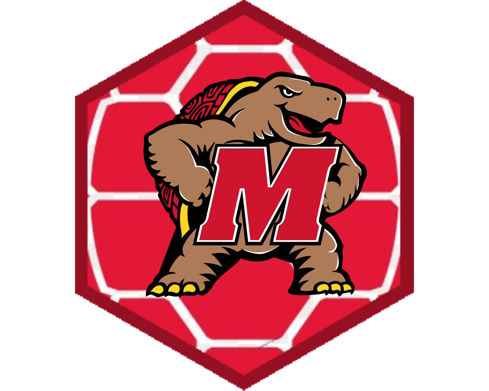

<!-- README.md is generated from README.Rmd. Please edit that file -->
  
  # goterps 🐢❤️📦  

 [](https://opensource.org/licenses/MIT)   

This R package is designed for students and teachers of the University of Maryland to download templates to create presentations with the university logo, as well as articles and use the university theme in ggplot2.

<!-- Use twitter from R. Get started by reading `vignette("rtweet")`. -->
  
## Installation 👇
  
This is a package in a developed state. So, you can download using this code:
  
 ``` r 
#install.packages("devtools")
library(devtools)
install_github("guadag12/goterps")
library(goterps)
```

### Download the Quarto Presentation 👩‍💼 🤳 👇:
  
 Running this function sends the package template to the path you want on your computer:
 
``` r
goterps_presentation(path = "~/Documents/test/")
```

## Contact ❤️

If you encounter a bug please make an issue! Feel free to write me with doubts to my gmail: guadag12@umd.edu or send me a DM on Twitter: [guadag12](https://twitter.com/guadag12) 
